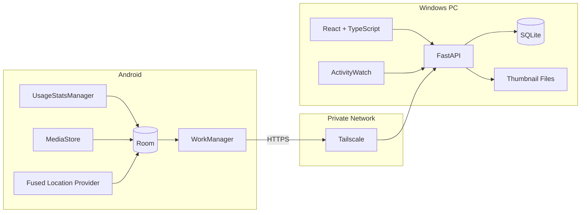
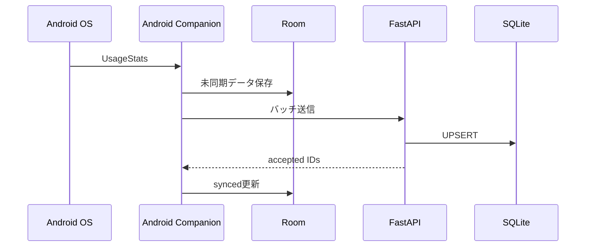
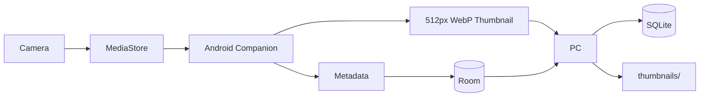

# life-timeline 技術構成

## 1. 全体構成

life-timeline は、以下の3つを中心に構成します。

1. Android Companion
2. PC Backend / Web UI
3. 外部データソース



## 2. 技術スタック

### PC Frontend

- React
- TypeScript
- Vite
- React Router
- MapLibre GL JS または Leaflet
- 必要に応じてグラフライブラリを追加

初期段階ではブラウザから `localhost` を開くローカルWebアプリとして開発します。

将来的に必要であれば、React UIをTauriでラップしてWindowsデスクトップアプリ化します。

### PC Backend

- Python
- FastAPI
- Pydantic
- SQLAlchemy または SQLModel
- Alembic
- SQLite

主な役割:

- Androidからの同期API
- タイムラインAPI
- 写真サムネイル配信
- ActivityWatch連携
- データのインポート / エクスポート
- バックアップ処理

### Android

- Kotlin
- Jetpack Compose
- Room
- WorkManager
- Retrofit / OkHttp
- UsageStatsManager
- MediaStore
- Fused Location Provider

Androidはライフログデータの収集、一時保存、PCへの同期に特化します。

### 通信

- Tailscale
- Tailscale Serve
- HTTPS

PCのFastAPIは原則として以下で待ち受けます。

```text
127.0.0.1:8000
```

Tailscale Serveを経由してAndroidからアクセスします。

```text
Android
   ↓
Tailscale
   ↓
Tailscale Serve
   ↓
127.0.0.1:8000
   ↓
FastAPI
```

FastAPIをLANやインターネットへ直接公開しないことで、自前の認証・TLS管理を最小化します。

## 3. 保存構成

```text
life-timeline-data/
├── lifelog.db
├── thumbnails/
│   └── 2026/
│       └── 09/
│           └── 03/
│               ├── <photo-id>.webp
│               └── ...
├── exports/
└── backups/
```

### SQLite

以下のような構造化データを保持します。

- devices
- app_sessions
- desktop_sessions
- location_points
- place_visits
- photos
- manual_events
- sync_state

### ファイルシステム

画像はSQLiteのBLOBとして保存せず、ファイルシステムに保存します。

PCへ送るのは原本ではなく、Android側で生成した軽量サムネイルのみです。

## 4. 外部サービス

### ActivityWatch

PC作業履歴の収集には既存のActivityWatchを利用します。

life-timeline側では、ActivityWatchのREST APIから以下を取り込みます。

- アクティブアプリ
- ウィンドウタイトル
- Webサイト利用履歴
- AFK情報

ActivityWatch自体を再実装しません。

### Google Photos

通常の収集経路には使用しません。

原本はGoogle Photosへ通常通りバックアップし、life-timelineではAndroidのMediaStoreから取得した写真情報とサムネイルを保存します。

将来的にはGoogle Photos Picker APIを利用し、以下の補助用途を検討します。

- 過去写真の手動インポート
- Android端末から削除済みの写真の補完
- 特定写真をGoogle Photos側から選択

## 5. データフロー

### Androidアプリ利用履歴



### 写真



### 位置情報

```text
Fused Location Provider
    ↓
LocationPoint
    ↓
Room
    ↓
同期
    ↓
SQLite
    ↓
PlaceVisit生成
    ↓
Map / Timeline
```

## 6. ローカルWebアプリとしての構成

開発時:

```text
React Vite
localhost:5173
      ↓
FastAPI
127.0.0.1:8000
      ↓
SQLite
```

本番ローカル利用時はReactをビルドし、FastAPIから静的ファイルを配信する構成も検討します。

```text
Browser
  ↓
localhost:8000
  ├── /api/*
  └── React build
```

## 7. 将来的なデスクトップ化

必要になった時点でTauriを導入します。

```text
Tauri
 ├── React UI
 └── FastAPI / local service
```

初期段階ではTauriを導入せず、データ収集・同期・表示の安定化を優先します。
