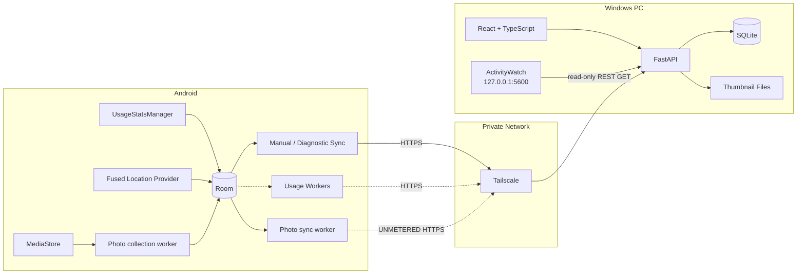
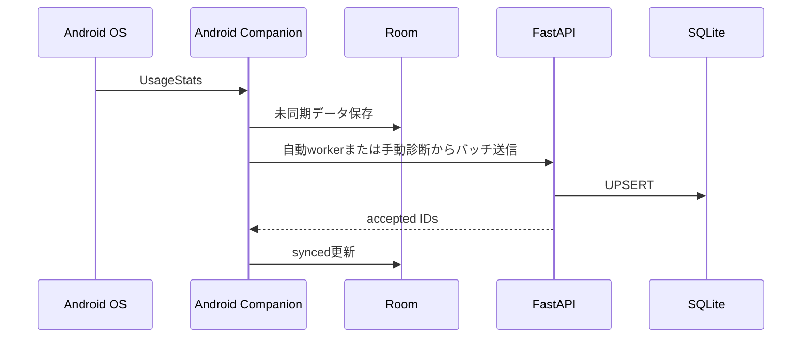
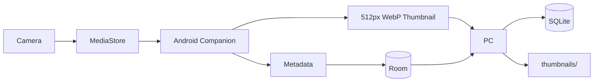

# life-timeline 技術構成

## 1. 全体構成

life-timeline は、以下の3つを中心に構成します。

1. Android Companion
2. PC Backend / Web UI
3. 外部データソース



## 2. 技術スタック

### PC Frontend

- React
- TypeScript
- Vite
- React Router
- Leaflet `1.9.4`（online basemapは明示opt-in）
- 必要に応じてグラフライブラリを追加

初期段階ではブラウザから `localhost` を開くローカルWebアプリとして開発します。

将来的に必要であれば、React UIをTauriでラップしてWindowsデスクトップアプリ化します。

### PC Backend

- Python
- FastAPI
- Pydantic
- SQLAlchemy または SQLModel
- Alembic
- SQLite

主な役割:

- Androidからの同期API
- タイムラインAPI
- 写真サムネイル配信
- ActivityWatch連携
- データのインポート / エクスポート
- バックアップ処理

### Android

- Kotlin
- Jetpack Compose
- Room
- WorkManager
- Retrofit / OkHttp
- UsageStatsManager
- MediaStore
- Fused Location Provider

Androidはライフログデータの収集、一時保存、PCへの同期に特化します。写真、AppSession、LocationのworkerとRoom leaseは独立させ、Locationの登録・watchdog・同期が既存workerをreplaceしないようにします。位置取得はFused Location Providerの`PRIORITY_BALANCED_POWER_ACCURACY`を使うbatched `PendingIntent`方式で、要求間隔と最小間隔は5分、最大batch遅延は15分です。foreground serviceは使用せず、OSのbackground制約による遅延・欠測を許容します。位置のraw pointはRoomでpendingとして保持し、accepted ACKを受けたIDだけをsyncedにします。写真収集は15分周期 / 5分flexで、BatteryNotLow・StorageNotLowを要求します。写真同期はUNMETERED・BatteryNotLow・StorageNotLowを要求し、20件単位、最大8分または10 batchで処理します。

### 通信

- Tailscale
- Tailscale Serve
- HTTPS

PCのFastAPIは原則として以下で待ち受けます。

```text
127.0.0.1:8000
```

Tailscale Serveを経由してAndroidからアクセスします。

```text
Android
   ↓
Tailscale
   ↓
Tailscale Serve
   ↓
127.0.0.1:8000
   ↓
FastAPI
```

FastAPIをLANやインターネットへ直接公開しないことで、自前の認証・TLS管理を最小化します。

## 3. 保存構成

```text
life-timeline-data/
├── lifelog.db
├── thumbnails/
│   └── 2026/
│       └── 09/
│           └── 03/
│               ├── <photo-id>.webp
│               └── ...
├── exports/
└── backups/
```

### SQLite

以下のような構造化データを保持します。

### Dimension / Master

- devices
- apps
- place naming is not persisted in the current schema; `PlaceVisit` keeps a derived center only
- categories

### Fact / Record

- app_sessions
- location_points
- place_visits
- media_items
- manual_records

### Optional Detail / Aggregate

- desktop_session_details
- daily_app_stats
- daily_device_stats
- daily_location_stats
- daily_media_stats
- sync_state

保存形式はTimeline専用にせず、各データを意味ごとのテーブルに分けます。Timeline、Statistics、Map、Photosなどの表示は、これらのデータから用途ごとに組み立てます。

### ファイルシステム

画像はSQLiteのBLOBとして保存せず、ファイルシステムに保存します。

PCへ送るのは原本ではなく、Android側で生成した最大辺512px・WebP lossy quality 65のthumbnailのみです。PC側のmetadataは`lifelog.db`、binaryはdata root直下の`thumbnails/`へ保存します。手動backup・restoreではFastAPIを停止し、この二つを含むdata root全体を一体として扱います。自動backup機能は現時点でありません。

## 4. 外部サービス

### ActivityWatch

PC作業履歴の収集には既存のActivityWatchを利用します。ActivityWatchは外部collectorであり、life-timelineは本体や内部DBを再実装・直接参照しません。連携は明示的なopt-in時だけ有効になり、`127.0.0.1:5600`のloopback REST APIへread-only GETを送ります。

life-timeline側では、ActivityWatchのREST APIから以下を取り込みます。

- アクティブアプリ
- ウィンドウタイトル
- Webサイト利用履歴
- AFK情報

window eventを`not-afk` periodとintersectionし、共通の`app_sessions`へ保存します。window titleとWeb URLは`desktop_session_details`へ分離し、既定の`app_only`では最小化します。`titles` / `web`へ広げる場合もincognito、非active browser、危険なURL、query / fragment / userinfoを抑止します。ActivityWatch停止時はcollectorのstatusだけを失敗扱いにし、Backend、既存Timeline、Android同期全体は継続可能にします。

### Google Photos

通常の収集経路には使用しません。

原本はGoogle Photosへ通常通りバックアップし、life-timelineではAndroidのMediaStoreから取得した写真情報とサムネイルを保存します。

将来的にはGoogle Photos Picker APIを利用し、以下の補助用途を検討します。

- 過去写真の手動インポート
- Android端末から削除済みの写真の補完
- 特定写真をGoogle Photos側から選択

## 5. データフロー

### Androidアプリ利用履歴



### 写真



### 位置情報

```text
Fused Location Provider
    ↓ batched PendingIntent
LocationUpdatesReceiver
    ↓ normalize / dedupe
Room: pending LocationPoint
    ↓ accepted ID ACK
Tailscale Serve / FastAPI
    ↓ transaction
SQLite: raw location_points
    ├─ stay_point_v1 → PlaceVisit
    └─ daily Map / Timeline query
```

位置permission、OSの位置情報サービス、battery最適化、PC停止中のpendingは[Phase 5位置情報の運用手順](development/phase5-location-operations.md)で切り分けます。背景tileは初期OFFで、ユーザーがオンライン背景地図を明示的に有効化した時だけOpenStreetMapへbrowserからrequestします。life-timelineのAPI payloadやmarker dataをtile providerへ送信しません。

## 6. ローカルWebアプリとしての構成

開発時:

```text
React Vite
localhost:5173
      ↓
FastAPI
127.0.0.1:8000
      ↓
SQLite
```

本番ローカル利用時はReactをビルドし、FastAPIから静的ファイルを配信する構成も検討します。

```text
Browser
  ↓
localhost:8000
  ├── /api/*
  └── React build
```

## 7. 将来的なデスクトップ化

必要になった時点でTauriを導入します。

```text
Tauri
 ├── React UI
 └── FastAPI / local service
```

初期段階ではTauriを導入せず、データ収集・同期・表示の安定化を優先します。
