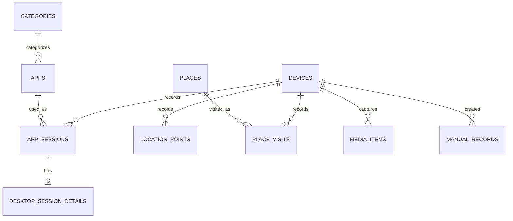

# life-timeline データモデル

## 1. 目的

このドキュメントでは、life-timelineで収集・保存するデータの構造を定義します。

life-timelineの中心機能はTimelineですが、保存形式をTimeline表示に最適化しすぎないことを重要な設計方針とします。同じデータをTimeline、Statistics、Map、Photos、Search、Exportなど複数の用途で再利用できる構造にします。

DBには「Timeline Item」という万能データを原本として保存せず、**事実データを意味ごとに正規化して保存**します。

---

## 2. データレイヤー

```text
Source
Android / ActivityWatch / User Input
        ↓
Collector Output
        ↓ 正規化
Normalized Data
AppSession / LocationPoint / PlaceVisit / MediaItem / ManualRecord
        ↓ 集計・変換
View / Aggregate
Timeline / Statistics / Map / Photos
```

PC側のNormalized Dataを長期保存するSource of Truthとします。Timeline用レスポンスや統計集計は、Normalized Dataから再生成できる派生データとして扱います。

---

## 3. ERイメージ



---

## 4. 共通ルール

### ID

UUID v7またはULIDを採用し、可能な限りデータ発生元で生成します。Androidで生成したIDをRoomとPCの両方で使うことで、再送時の重複登録を防ぎます。

### 時刻

時刻は原則としてUTCのUnix epoch millisecondsを`INTEGER`で保存します。

```text
started_at_ms
ended_at_ms
recorded_at_ms
captured_at_ms
```

表示時にユーザーのtimezoneへ変換します。

### duration

期間を持つデータでは、統計処理を簡単にするため以下を保持します。

```text
started_at_ms
ended_at_ms
duration_ms
```

### device_id

すべての端末由来データに`device_id`を持たせ、Androidのみ、Windowsのみ、全端末合計などを同じモデルから集計可能にします。

---

# 5. Dimension / Master

## devices

```text
devices
--------------------------
id              TEXT PK
name            TEXT
platform        TEXT
created_at_ms   INTEGER
last_seen_at_ms INTEGER
```

`platform`の初期値は`android`と`windows`です。

## categories

```text
categories
----------------
id            TEXT PK
name          TEXT
created_at_ms INTEGER
```

例: Development / Browser / Entertainment / Communication / Productivity / Game

## apps

AndroidとWindowsのアプリを共通表現します。

```text
apps
-------------------------
id            TEXT PK
platform      TEXT
identifier    TEXT
display_name  TEXT
category_id   TEXT NULL FK
icon_path     TEXT NULL
created_at_ms INTEGER
```

`identifier`の例:

```text
Android: com.google.android.youtube
Windows: Code.exe
```

## places

```text
places
-------------------------
id            TEXT PK
name          TEXT
latitude      REAL
longitude     REAL
radius_m      REAL
category      TEXT NULL
created_at_ms INTEGER
```

自宅、大学、駅など継続的に参照する場所を表します。

---

# 6. Fact / Record

## app_sessions

Android / Windowsのアプリ利用セッションを共通形式で保存します。

```text
app_sessions
-------------------------
id             TEXT PK
device_id      TEXT FK
app_id         TEXT FK
started_at_ms  INTEGER
ended_at_ms    INTEGER
duration_ms    INTEGER
source         TEXT
created_at_ms  INTEGER
```

`source`例: `android_usage_stats`, `activitywatch`

ここからアプリ別・端末別・カテゴリ別利用時間、セッション回数、平均セッション時間、時間帯別利用、週次/月次推移などを算出できます。

## desktop_session_details

PCだけが持つ追加情報を分離します。

```text
desktop_session_details
-------------------------
session_id      TEXT PK FK
window_title    TEXT NULL
url             TEXT NULL
source_event_id TEXT NULL
```

アプリ利用そのものは`app_sessions`へ統一し、共通統計とPC固有情報を分離します。

## location_points

Androidから取得した位置情報の生データです。

```text
location_points
-------------------------
id             TEXT PK
device_id      TEXT FK
recorded_at_ms INTEGER
latitude       REAL
longitude      REAL
accuracy_m     REAL NULL
altitude_m     REAL NULL
speed_mps      REAL NULL
source         TEXT
created_at_ms  INTEGER
```

用途: 移動経路、移動距離、PlaceVisit生成、写真位置の補完。

## place_visits

LocationPointから生成した「ある場所に滞在していた」という派生Factです。

```text
place_visits
-------------------------
id                    TEXT PK
device_id             TEXT NOT NULL FK devices
started_at_ms         INTEGER NOT NULL
ended_at_ms           INTEGER NOT NULL
duration_ms           INTEGER NOT NULL
center_latitude       REAL NOT NULL
center_longitude      REAL NOT NULL
radius_m              REAL NOT NULL
point_count           INTEGER NOT NULL
algorithm_version     TEXT NOT NULL
source_first_point_id TEXT NOT NULL FK location_points
source_last_point_id  TEXT NOT NULL FK location_points
created_at_ms         INTEGER NOT NULL
```

`stay_point_v1`から再生成できる派生Factです。IDは同じdevice・algorithm version・source point範囲に対し決定的です。用途: 場所別滞在時間、訪問回数、外出時間、Timeline、Map。

## media_items

写真と動画の共通Factです。現Phase 4の同期APIが書き込むのは`type = photo`だけです。

```text
media_items
-------------------------
id                    TEXT PK
device_id             TEXT FK
type                  TEXT                    # photo / video
source                TEXT                    # android_media_store
source_id             TEXT
filename              TEXT
captured_at_ms        INTEGER
width                 INTEGER NULL
height                INTEGER NULL
duration_ms           INTEGER NULL
latitude              REAL NULL
longitude             REAL NULL
thumbnail_path        TEXT NULL
thumbnail_mime_type   TEXT NULL               # image/webp
thumbnail_width       INTEGER NULL
thumbnail_height      INTEGER NULL
thumbnail_size_bytes  INTEGER NULL
thumbnail_sha256      TEXT NULL
mime_type             TEXT
created_at_ms         INTEGER
```

一意性は`device_id + source + source_id`です。緯度・経度は両方nullか両方値を持ちます。Thumbnail一式はnullか、WebP path / dimension / byte size / SHA-256がすべて揃います。Phase 4ではedge最大512px、1MiB以下のWebPを保存し、原本画像は保存・送信しません。metadataはSQLite、thumbnailはPC data rootの`thumbnails/`配下に保存します。

Full photo accessでは収集有効化時のbaselineより後に追加されたDCIM写真を対象とします。Android 14以降のpartial accessでは選択写真を明示的に扱います。Android MediaStore上の原本削除はこのrecordやthumbnailの削除を意味しません。

将来: `google_photos_picker`, `import`。動画記録、原本管理は別の実装判断とします。

## manual_records

```text
manual_records
-------------------------
id             TEXT PK
device_id      TEXT NULL FK
title          TEXT
note           TEXT NULL
started_at_ms  INTEGER
ended_at_ms    INTEGER NULL
latitude       REAL NULL
longitude      REAL NULL
created_at_ms  INTEGER
```

自動記録では残らない文脈を補完します。

---

# 7. Aggregate / Cache

統計表示の高速化が必要になった時点で導入します。MVPでは必須ではありません。

## daily_app_stats

```text
daily_app_stats
-------------------------
local_date       TEXT
device_id        TEXT
app_id           TEXT
usage_ms         INTEGER
session_count    INTEGER
first_used_at_ms INTEGER
last_used_at_ms  INTEGER
```

一意キー: `(local_date, device_id, app_id)`

## daily_device_stats

```text
local_date
device_id
usage_ms
session_count
```

## daily_location_stats

```text
local_date
distance_m
outside_duration_ms
place_count
point_count
```

## daily_media_stats

```text
local_date
photo_count
video_count
```

AggregateはSource of Truthではなく、Normalized Dataから完全再生成可能なキャッシュとします。

---

# 8. Timeline

TimelineはDBテーブルではなくQuery/APIレイヤーで生成します。

```text
app_sessions
place_visits
media_items
manual_records
        ↓
Timeline Query
        ↓
TimelineItem[]
```

TypeScriptではDiscriminated Unionを使います。

```ts
type TimelineItem =
  | AppSessionTimelineItem
  | PlaceVisitTimelineItem
  | MediaTimelineItem
  | ManualRecordTimelineItem
```

Timelineは中心UIですが、保存形式ではありません。

---

# 9. Statistics

Statistics APIもNormalized DataまたはAggregateから生成します。

例:

```http
GET /api/v1/stats/apps?from=...&to=...
```

同じ`app_sessions`から、Timeline、アプリ別棒グラフ、日次推移、カテゴリ統計、検索など複数の表現を生成します。

---

# 10. Map / Photos

Map専用の原本テーブルは作りません。

```text
LocationPoint → 移動経路
PlaceVisit    → 滞在場所
MediaItem     → 撮影地点
```

Photos画面も`media_items`を日付・場所などで絞り込んで表示します。

---

# 11. Android側の同期状態

Roomでは各送信対象について以下を管理します。

```text
pending
synced
```

AppSessionの同期状態は引き続き`pending`と`synced`だけを持ちます。送信中の表示は画面上の一時状態として扱い、Sessionを永続的な`syncing`へ一括変更しません。自動workerと手動診断は別々のRoom `background_work_state` leaseで直列化し、PC側Factには`synced`を持たせず、PCに保存された時点で同期済みとみなします。重複防止はAndroidで生成したIDとPC側の一意制約で行います。WorkManagerのAppSession unique work、CONNECTED / BatteryNotLow制約、指数backoff、Room v2 leaseはPhase 3で実装済みです。写真用workerはwork nameとleaseを分離し、collectionはBatteryNotLow / StorageNotLow、uploadはUNMETERED / BatteryNotLow / StorageNotLowを要求します。Android Room version 4が写真entityとMediaStore cursorを保持し、PC側の写真schemaはAlembic `0002_media_items`です。v3→v4では既存写真recordを保持してgeneration cursorをresetします。

### Phase 3のbackground work state

Room v2では`background_work_state`を追加し、collectionとsyncそれぞれについて次の診断状態を保持します。

- `work_key`、`lease_owner`、取得時刻、期限切れ時刻。
- 最終試行・最終成功時刻、`last_result`、`last_error_kind`。
- 連続失敗回数と更新時刻。

leaseはworker、手動処理、process再生成の境界をまたぐ排他用であり、Sessionの同期状態を置き換えません。ACK済みだけを`synced`へ更新し、未ACKは常に`pending`として再送可能な状態を保ちます。endpoint、package名、payload、tailnet名はこの診断状態へ保存しません。

---

# 12. Index

時間検索が中心になるため、以下を初期候補とします。

```sql
CREATE INDEX idx_app_sessions_started
ON app_sessions(started_at_ms);

CREATE INDEX idx_app_sessions_app_time
ON app_sessions(app_id, started_at_ms);

CREATE INDEX idx_location_points_time
ON location_points(recorded_at_ms);

CREATE INDEX idx_place_visits_time
ON place_visits(started_at_ms);

CREATE INDEX idx_media_items_captured
ON media_items(captured_at_ms);
```

複合Indexは実際のQueryを計測して追加します。

---

# 13. データ量

最も増えやすいのは`location_points`です。5分ごとの取得なら約288件/日、約10.5万件/年で、SQLiteでも十分扱える規模です。

将来的には必要に応じて、古いLocationPointの間引き、PlaceVisit生成後の圧縮、Index最適化などを検討します。

写真・動画は原本を保持せずサムネイルのみなので、ストレージ増加を抑えます。

---

# 14. Export

長期保存する個人データであるため、アプリを使わなくなっても取り出せることを重要視します。

候補:

```text
AppSession    → CSV / JSON
LocationPoint → GeoJSON / CSV
PlaceVisit    → JSON / CSV
MediaItem     → JSON + thumbnail files
ManualRecord  → JSON / CSV
```

---

写真を含むPC data rootでは`lifelog.db`と`thumbnails/`が一つのbackup / restore単位です。完全な復旧では両方を同じsnapshotから戻します。手順と自動backup機能の現状は[README](../README.md#手動バックアップと復旧)を参照してください。

# 15. 今後決める事項

- UUID v7 / ULIDのどちらを採用するか
- SQLAlchemy / SQLModelの選択
- Categoryの初期値
- AppSession生成ルール
- ActivityWatchイベントの統合ルール
- PlaceVisit判定アルゴリズム
- timezone履歴の保存方法
- Aggregate導入タイミング
- LocationPointの保持・間引き方針
