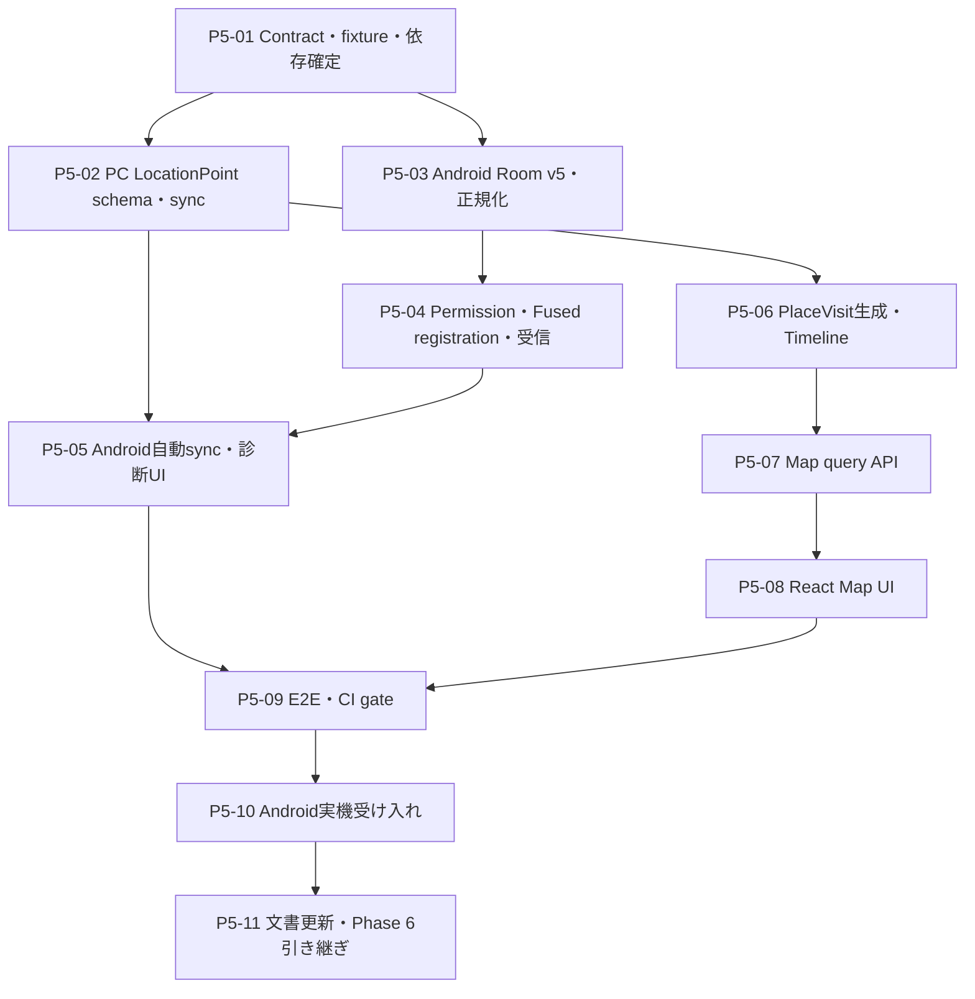

# Phase 5 詳細実装計画: Location

- 作成日: 2026-09-13
- 対象: Androidのバックグラウンド位置収集・一時保存・自動同期、PCのLocationPoint保存・PlaceVisit生成・Timeline / Map表示
- 前提: Phase 4の写真同期通常系、Phase 3の自動同期基盤、既存6 required checksがmainへ反映済みであること

## 1. 参照資料とPhase 5の位置付け

| 資料 | 確定済みの前提 | Phase 5での扱い |
| --- | --- | --- |
| [implementation-plan.md](../implementation-plan.md) | Fused Location Provider、background location、Room、同期、Map、PlaceVisitを対象とする | その日の移動経路と主な滞在場所をPCで確認できる経路を完成させる |
| [product-spec.md](../product-spec.md) | 高精度なリアルタイム追跡ではなく、振り返りとbatteryの均衡を優先する | 5分は要求間隔とし、OSによる遅延を失敗扱いしない |
| [data-model.md](../data-model.md) | `location_points`を原本、`place_visits`を再生成可能な派生Factとする | raw pointを失わず、表示用の訪問判定と経路をPCで生成する |
| [architecture.md](../architecture.md) | Androidは収集と一時保存、PC SQLiteを長期保存の正本とする | ACK前はRoomへ保持し、ACK後はAndroidから安全にcleanupする |
| [technical-design.md](../technical-design.md) | data type別batch、ACK済みだけsynced、location batch目安200件 | Location専用contract、worker、lease、retry、診断を追加する |
| [phase3-automatic-sync.md](phase3-automatic-sync.md) | unique work、WorkerFactory、期限付きRoom lease、指数backoffが完成済み | 同期基盤を再利用し、位置の登録・受信はWorkManagerの周期収集と分離する |
| [phase4-photos.md](phase4-photos.md) | 複合Timeline、point event query、nullable座標、data type別workerが完成済み | EXIF位置をMapへ重ねるが、LocationPointの代替にはしない |
| [phase4-acceptance.md](../development/phase4-acceptance.md) | 写真の通常系はPASS、OS/OEM依存の拡張シナリオは任意として分離済み | Phase 5も自動テスト、通常系実機、拡張実機保証を分ける |
| [toolchains.md](../development/toolchains.md) | Android minSdk 26、target / compile API 36、JDK 17 | API 26〜36のpermission・background制約を明示的にtestする |

Phase 4の通常系受け入れは完了しており、PCには`media_items.latitude / longitude`、複数typeのTimeline union、写真専用workerと安全な診断が存在する。一方、現行mainにはLocation用Android entity、同期contract、PC table、Map routeがなく、README先頭の「Phase 3まで実装済み」も実態より古い。Phase 5では既存の写真・AppSession経路を変更せず、Locationを独立したdata sourceとして追加する。

### 1.1 Android公式仕様から採用する制約

- foregroundの位置権限とbackground位置権限は段階的に要求する。Android 11以降では同時要求が無視され、background許可はsystem settingsでユーザーが選ぶ。[Request location access at runtime](https://developer.android.com/develop/sensors-and-location/location/permissions/runtime) / [Request background location](https://developer.android.com/develop/sensors-and-location/location/permissions/background)
- Android 12以降ではユーザーがapproximate locationを選べる。fineを要求していてもcoarseだけの状態を正常な縮退動作として扱い、精度を偽らない。
- Fused Location Providerはcoarseまたはfine permissionを必要とし、backgroundで受け取るには`ACCESS_BACKGROUND_LOCATION`またはlocation foreground serviceが必要である。継続更新には`requestLocationUpdates`、process非依存の配信には`PendingIntent`を利用する。[FusedLocationProviderClient](https://developers.google.com/android/reference/com/google/android/gms/location/FusedLocationProviderClient)
- Android 8以降、background appへの配信は数回/時程度に制限され得る。batched requestでは配信間隔が長くてもbatch内により細かい履歴を受け取れるが、5分ごとの到着は保証されない。[Background Location Limits](https://developer.android.com/about/versions/oreo/background-location-limits)
- 即時性を必要としない位置取得では`setMaxUpdateDelayMillis()`を使ってbatch化し、batteryを優先する。[About background location and battery life](https://developer.android.com/develop/sensors-and-location/location/battery)
- foreground serviceは常時ユーザーに認識可能なnotificationを必要とし、Android 14以降では`location` service typeと専用permissionが必要である。Phase 5の振り返り用途では常駐notificationと高頻度追跡を正当化しないため採用しない。[Foreground service types](https://developer.android.com/develop/background-work/services/fgs/service-types)
- `play-services-location`は実装PR開始時に公式release notesでstable versionと既存toolchainとの互換性を再確認し、version catalogとtoolchainsへ同じPRで固定する。[Google Play services release notes](https://developers.google.com/android/guides/releases)

## 2. ゴールと実装範囲

### 2.1 到達する状態

```text
ユーザーが位置記録を有効化
  ├─ foregroundのcoarse / fineを段階的に要求
  ├─ background許可の理由とsystem setting上の選択肢を説明
  └─ 許可済みならFused Location Providerへbatched PendingIntentを登録

Android OS / Google Play services
  └─ LocationUpdatesReceiver
       ├─ batchを時刻順に正規化
       ├─ opt-in以前・不正値・同一fixの再配信を除外
       ├─ deterministic ULIDでRoomへpending保存
       └─ Location専用syncをenqueue

unique location sync
  └─ CONNECTED && BatteryNotLow
       ├─ 古いpendingから最大200件をJSON送信
       ├─ PCがLocationPointをSQLiteへ冪等保存
       ├─ PCが対象端末のPlaceVisitを決定的に再生成
       ├─ accepted IDだけAndroidでsynced化
       └─ synced rowをAndroidからbounded cleanup

PC
  ├─ GET /api/v1/timeline にPlaceVisitを統合
  ├─ GET /api/v1/map でroute / visit / geotagged photoを返す
  └─ React Mapで日付単位の経路、滞在、写真地点を表示
```

アプリ画面を閉じ、端末がlockされた状態でも、OSが許す範囲で位置fixがRoomへ蓄積される。PC停止中はpendingを保持し、復旧後に同じIDで再送する。PCではraw LocationPointを長期保存し、PlaceVisitとMapを再生成できる。

### 2.2 実装するもの

- Android 26〜36のcoarse / fine / background permission状態と、位置サービスOFFを区別するUI。
- ユーザー操作による位置記録のON/OFF、段階的permission request、system settingsから戻った際の再評価。
- Fused Location Providerのbalanced-power、5分要求、最大15分batchによる`PendingIntent`更新。
- process death、端末再起動、app update後の登録回復と、disable / permission取消時の登録解除。
- Fused `Location` batchの検証、時刻順処理、deterministic ID、Room version 5のpending管理。
- Location専用のone-time sync、stable unique name、lease、retry、run budget、最大200件batch。
- `POST /api/v1/sync/locations` version 1 contractとAndroid / Backend共通fixture。
- PC Alembic `0003`の`location_points` / `place_visits`、validation、冪等保存、SQLite busy処理。
- version固定された決定的なPlaceVisit生成と、raw pointからの再生成手段。
- `GET /api/v1/map`、Timelineの`place_visit` union、安定sort、timezone日境界。
- ReactのMap画面、route、visit circle / marker、EXIF付きphoto marker、text alternative。
- online basemapを明示操作後だけ読み込むprivacy境界、OSM attribution、tile error時のlocal overlay維持。
- Unit / Room / instrumentation / Backend / Frontend / Playwright / Android実機受け入れ。
- README、上位設計、toolchains、Phase 5受け入れ記録の更新。

### 2.3 Phase 5に含めないもの

| 対象 | 実施時期・理由 |
| --- | --- |
| ナビゲーション、リアルタイム共有、緊急追跡 | 製品目的外。低遅延や高精度を保証しない |
| 常駐location foreground service | 継続notificationとbattery負担が振り返り用途に見合わない |
| `PRIORITY_HIGH_ACCURACY`の常時利用 | batteryを優先し、balanced powerで受け入れ可能性を検証する |
| geofence、Activity Recognition、加速度によるadaptive sampling | Phase 7以降。初版の原因切り分けを難しくしない |
| reverse geocoding、経路補正、road snapping | 外部へ座標を送るため不採用。raw routeを表示する |
| 自宅・大学等のPlace命名、編集、category、place merge | Phase 7。初版は「滞在地点」と位置・時間で識別する |
| `places` masterと`place_id`紐付け | 命名UIとmatching規約がないため先行作成しない |
| 移動距離・外出時間・場所別統計、Calendar badge | Phase 7。raw / derived dataから追加できる境界だけ整える |
| 任意期間・複数日Map、heatmap、検索、Export | Phase 7。Phase 5はTimelineと同じ1日単位に固定する |
| Android上の地図表示 | PC Web UIを正規の閲覧面とする |
| offline tile download、tile cacheの独自実装 | OSM標準tileのprefetchは禁止されており、Phase 5では扱わない |
| LocationPointの間引き・PCからの削除 | 保持量を計測してから決める。Phase 5ではrawを正本として保持する |
| EXIFのない写真へのLocationPoint補完 | 誤関連付け規約が未確定のため行わない |

## 3. 確定する振る舞い

### 3.1 opt-inとpermission

位置permissionが付与されただけでは収集開始とみなさない。DataStoreの`location_collection_enabled`はユーザーの明示opt-inだけを表し、実際のpermissionと端末の位置サービス状態は毎回OSへ問い合わせる。

| 状態 | Android UI | 収集動作 |
| --- | --- | --- |
| opt-in OFF | `位置情報: 無効` | Fused requestを解除し、新規fixを保存しない。pendingは削除しない |
| foreground未許可 | `位置情報: 権限が必要` | 収集しない。説明後のbutton操作からcoarse + fineを要求する |
| approximate + background許可 | `位置情報: 有効（概算）` | 収集するが、経路・滞在の精度が下がることを表示する |
| precise、background未許可 | `位置情報: バックグラウンド許可が必要` | 画面表示中の診断fixだけ取得可能。通常のbackground収集は開始しない |
| precise + background許可 | `位置情報: 有効（正確）` | batched PendingIntentを登録する |
| 端末の位置サービスOFF | `位置情報: 端末設定でOFF` | request登録を試行せず、既存pendingを維持する |
| permission取消 / auto-reset | `位置情報: 権限が必要` | requestを解除し、Room cursorやpendingを変更しない |

有効化buttonを押した時点で`location_collection_started_at_ms`を先に保存し、permission画面中に発生したfixを時刻で判定できるようにする。Android 11以降ではforeground許可後に教育画面を挟み、`getBackgroundPermissionOptionLabel()`で端末上の選択肢名を示してapp settingsへ案内する。拒否してもApp UsageとPhotosは利用できる。

- API 26〜28はbackground専用runtime permissionがないため、coarse / fine許可後に登録できる。
- API 29はforeground許可と`ACCESS_BACKGROUND_LOCATION`を別の段階でruntime requestする。
- API 30以降はforeground許可後、教育UIからapp settingsへ案内し、ユーザーが「常に許可」に相当する選択をしたことを復帰時に再判定する。

disable後に再度enableした場合は開始時刻を更新する。off期間のcached fixは`recorded_at_ms < current started_at_ms`として保存しない。既存pendingはユーザーの有効期間中に取得済みの記録なので同期対象に残す。

### 3.2 取得方式とlifecycle

- `FusedLocationProviderClient.requestLocationUpdates(LocationRequest, PendingIntent)`を使い、callbackをActivityやprocess lifecycleへ結び付けない。Fused Locationが`LocationResult`をintent extrasへ追加できるよう、PendingIntentはAPI 31以降`FLAG_MUTABLE`とし、component/action/dataを明示して送信先を限定する。
- `LocationUpdatesReceiver`は`LocationResult.extractResult(intent)`からbatchを取り出し、`goAsync()`の有限時間内でRoom transactionを完了する。重いnetwork同期は行わず、WorkManagerへ委譲する。
- Main画面の明示的な「現在地を1回取得して送信」操作では、foreground中に`FusedLocationProviderClient.getCurrentLocation(CurrentLocationRequest, CancellationToken)`を1回呼ぶ。balanced power、`maxUpdateAgeMillis = 0`、最大30秒とし、過去cacheを現在地として扱わない。返ったfixは`LocationUpdateProcessor`と同じopt-in / permission再確認、正規化、dedupeを通してRoomへ保存し、pendingがあればLocation syncをenqueueする。fixが得られない場合は保存せず、座標やprovider payloadを表示・記録しない。
- このone-shot取得はユーザーがボタンを押した場合だけ実行する。app resume、boot、package update、watchdog、AppSession収集から暗黙に呼び出さない。
- enable直後はunique one-time registration workをenqueueする。登録済みの同一PendingIntentは同じrequestへ更新されるため冪等である。
- `BOOT_COMPLETED` / `MY_PACKAGE_REPLACED`では位置を直接取得せず、unique registration workだけをenqueueする。
- 12時間ごとのregistration watchdogをWorkManagerに保持し、OS・Play services・processの状態変化後に登録を回復する。15分以内の復旧は保証しない。
- disable時は`removeLocationUpdates(PendingIntent)`をbest effortで実行し、registration workをcancelする。解除APIが失敗してもreceiverがDataStoreのopt-inを再確認してfixを破棄する。
- force-stop中はAndroid仕様上の自動再開を保証しない。ユーザーがアプリを再度開いた時に登録を回復する。
- foreground service、exact alarm、wake lockの独自取得は追加しない。

### 3.3 取得・同期の固定値

| 項目 | Phase 5の値 | 理由 |
| --- | --- | --- |
| Fused priority | `PRIORITY_BALANCED_POWER_ACCURACY` | 高精度GPS常時利用を避ける |
| requested interval | 5分 | product-specの初期案を要求値として採用する |
| minimum update interval | 5分 | 他appの高頻度取得へ無制限に追随しない |
| maximum update delay | 15分 | batch deliveryでbatteryを抑える |
| wait for accurate fix | false | fix待ちでbackground workを長時間保持しない |
| registration work name | `life_timeline_location_registration_v1` | enable / boot / updateの重複登録を防ぐ |
| registration watchdog | `life_timeline_location_registration_watchdog_v1`、12時間 / flex 1時間 | registration消失からeventualに回復する |
| sync work name | `life_timeline_location_sync_v1` | AppSession / Photoのworkと分離する |
| registration lease | `location_registration_v1` | UI / boot / watchdogを直列化する |
| sync lease | `location_sync_v1` | 手動 / receiver / retryの同時送信を防ぐ |
| sync constraint | `CONNECTED`、`BatteryNotLow` | JSONは小さく、meteredでも記録の滞留を避ける |
| sync backoff | exponential、初期15分 | AppSessionと同じnetwork復旧特性を使う |
| upload batch | 200件 | technical-designのLocation目安を固定する |
| run budget | 最大20 batchまたは8分 | WorkManagerを占有し続けない |
| future clock tolerance | 現在より5分先まで | 軽微な端末clock skewを許し、明白な未来値を捨てる |
| route表示accuracy | `accuracy_m <= 1,000` | approximate状態も概略として表示可能にする |
| PlaceVisit accuracy | `accuracy_m <= 200` | 低精度fixで架空の滞在を作らない |

5分、15分、12時間はいずれもdeadlineではない。Doze、background limit、OEM最適化、位置サービス、Play services、電波状況により欠測・遅延する。

### 3.4 LocationPointの正規化とdedupe

- `recorded_at_ms`はFused `Location.time`を使い、receiver到着時刻へ置き換えない。
- latitude / longitudeはfiniteかつ範囲内、timestampは現在+5分以下、accuracy / altitude / speedはfiniteかつ非負の場合だけ保存する。不正なoptional値は`null`にし、不正な座標・時刻を持つfixだけを破棄する。
- `recorded_at_ms < location_collection_started_at_ms`のcached fixは破棄する。
- batchは`recorded_at_ms`、`elapsedRealtimeNanos`、座標の順で安定sortしてから保存する。batchがout-of-orderでもPCへ時刻順に送れるようにする。
- 同じFused fixの再配信に対し、`recorded_at_ms`、`elapsedRealtimeNanos`、緯度・経度のE7整数表現からsource fingerprintを作る。
- LocationPoint IDはtimestampをULIDの時刻部、`SHA-256(device_id + source fingerprint)`の先頭80 bitをrandomness部にしたdeterministic ULIDとする。同じfixはRoom cleanup後に再配信されても同じIDになる。
- `elapsedRealtimeNanos`とsource fingerprintはAndroid内のdedupe用でありPC APIへ送らない。raw provider名、extras、SSID、cell情報も保存・送信しない。
- 同時刻の異なるfixは座標とelapsed timeが異なるため別IDになる。ID衝突でcontentが異なる場合は自動上書きせず`conflict`として診断する。
- mock判定はproduction dataの破棄条件にしない。instrumentationと開発端末で生成した位置も同じvalidationを通し、実データとの混在を避ける運用で分離する。

### 3.5 ACK、削除、取消

- PC ACKを受け取ったIDだけRoomで`synced`へconditional updateし、その後bounded cleanupする。unknown ACKはcontract errorとし、未ACK rowを残す。
- response消失時は全件pendingのまま同じIDで再送する。PCは同一contentならACKし、異なるcontentなら409を返す。
- Androidのsynced LocationPointはPCを正本として削除できる。crashで残ったsynced rowは次回cleanup対象にする。
- Android上で位置記録をOFFにしても、PC上の履歴を削除しない。permission取消や位置サービスOFFもdelete eventへ変換しない。
- life-timeline上からの明示削除、期間削除、PCからAndroidへの削除伝播はPhase 7へ送る。

## 4. Android詳細設計

### 4.1 dependencyとManifest

`android/gradle/libs.versions.toml`へGoogle Play services Locationを追加し、`android/app/build.gradle.kts`から参照する。versionは実装時のstableを公式release notesで確認し、未検証のdynamic rangeを使わない。

Manifestへ次を追加する。

```xml
<uses-permission android:name="android.permission.ACCESS_COARSE_LOCATION" />
<uses-permission android:name="android.permission.ACCESS_FINE_LOCATION" />
<uses-permission android:name="android.permission.ACCESS_BACKGROUND_LOCATION" />
<uses-permission android:name="android.permission.RECEIVE_BOOT_COMPLETED" />
```

`LocationUpdatesReceiver`と再登録用receiverは必要最小限のexport設定にし、任意appからLocation payloadやregistration Intentを注入できないようにする。foreground service関連permission / serviceは宣言しない。

### 4.2 component境界

```text
LocationPermissionChecker
  └─ opt-in / foreground精度 / background / location servicesを判定

LocationRequestController
  ├─ stable PendingIntentを生成
  ├─ register(): permission再確認後にrequestLocationUpdates
  └─ unregister(): removeLocationUpdates

LocationUpdatesReceiver
  └─ LocationCollectionRepository.persist(batch)
       ├─ normalize / validate / deterministic ID
       └─ Room transaction + sync enqueue

LocationRegistrationWorker
  └─ BackgroundExecutionCoordinator(registration lease)

LocationSyncWorker
  └─ LocationSyncRepository
       ├─ oldest pending 200件
       ├─ POST /api/v1/sync/locations
       └─ ACK conditional update / cleanup
```

`AppContainer` / `WorkerDependencies` / `LifeTimelineWorkerFactory`へfactoryを追加するが、既存workerのconstructorとwork nameは変えない。Android framework / Google Play services型はadapter内へ閉じ込め、Repositoryはfake inputでpureにtestできるようにする。

### 4.3 Room version 5

`android_location_points`を追加する。

```text
android_location_points
--------------------------------
id                         TEXT PK
source                     TEXT NOT NULL = android_fused_location
recorded_at_ms             INTEGER NOT NULL
latitude                   REAL NOT NULL
longitude                  REAL NOT NULL
accuracy_m                 REAL NULL
altitude_m                 REAL NULL
speed_mps                  REAL NULL
elapsed_realtime_nanos     INTEGER NOT NULL
source_fingerprint         TEXT NOT NULL UNIQUE
sync_status                TEXT NOT NULL  -- pending | synced
received_at_ms             INTEGER NOT NULL
synced_at_ms               INTEGER NULL
last_error_kind            TEXT NULL
```

制約:

- 緯度`-90..90`、経度`-180..180`、時刻とelapsed timeは非負。
- accuracy / speedはnullableかつ非負。altitudeはnullableなfinite値をRepositoryで保証する。
- `source = android_fused_location`、`sync_status IN (pending, synced)`。
- indexは`(sync_status, recorded_at_ms, id)`、uniqueは`source_fingerprint`。
- `MIGRATION_4_5`は既存7 tableと写真triggerを保持し、destructive migrationを使わない。
- v1→v2→v3→v4→v5、v4 fixture→v5、fresh v5をinstrumentationで確認し、schema JSONをcommitする。

DataStoreへ`location_collection_enabled`と`location_collection_started_at_ms`だけを追加する。permission、request登録済み、最終位置はDataStoreの正としない。診断は既存`background_work_state`へregistration / syncの結果分類だけを保存する。

### 4.4 受信と保存

1. Receiver開始時とRoom書込み直前にopt-inを確認する。
2. IntentにLocationResultがなければ安全に終了し、payload内容をlogへ出さない。
3. 大きなbatchは1,000件ずつRoom transactionへ分割し、Intent内のfixをsilent truncationしない。
4. 各fixを正規化し、無効fixの件数だけをdiagnosticへ記録する。
5. deterministic ID / fingerprintを作り、`INSERT OR IGNORE`相当のDAOで一括保存する。
6. 新規pendingが1件以上ならlocation syncをenqueueする。
7. Receiverの完了・cancelを必ず処理し、例外時も座標をlogcatへ出さない。

Room transaction失敗時はOSから同じIntentが必ず再配信されるとは保証しない。1 batchの保存は小さく保ち、fault injection testと実機長時間試験で発生率を確認する。

### 4.5 registrationと同期

registration結果は`registered`、`disabled`、`permission_required`、`location_services_off`、`play_services_unavailable`、`retry`へ分類する。permission不足をWorkManager retry loopにせず正常終了し、UIから解決方法を示す。一時的なPlay services障害だけretryする。

Location syncは既存`BackgroundExecutionCoordinator`のleaseとheartbeatを利用する。HTTP分類は次のとおり。

| 結果 | Androidの扱い |
| --- | --- |
| 2xx + valid ACK | acceptedだけsynced、cleanup後に残件があればcontinuation |
| timeout / IO / 408 / 425 / 429 / 5xx | pending維持、WorkManager `retry` |
| 400 / 404 / 409 / 413 / 422 | pending維持、`failure`。自動無限retryしない |
| malformed JSON / unknown ACK / duplicate ACK | contract failure。全件pending維持 |
| cancellation | 伝播し、failureとして上書きしない |

AppSessionの「収集して同期」はLocationの現在地取得を暗黙に開始しない。Android UIにはLocation専用の「登録状態を確認」「現在地を1回取得して送信」「未同期を送信」を設け、収集permissionとnetwork診断を分離する。登録成功は継続更新requestが受け付けられたことを表し、位置fixの受信・保存・同期成功とは別状態として表示する。

### 4.6 Android UI

Main画面へ次を追加する。

- 位置記録ON/OFFと、収集内容・PC保存・削除非伝播の説明。
- `無効 / 権限が必要 / background許可が必要 / 概算 / 正確 / 位置サービスOFF / 登録エラー`の状態。
- 最終受信時刻、最終registration成功、最終sync成功、pending件数。
- foreground許可要求、background設定を開く、端末の位置設定を開く、登録状態を確認、現在地を1回取得して送信、未同期を送信するbutton。
- approximateでも利用可能だが、PlaceVisitが生成されない可能性がある説明。

座標、精度、移動速度、端末ID、endpointはMain画面や通常logへ表示しない。開発用raw画面もPhase 5では作らない。

## 5. Location同期contract

### 5.1 version 1 request / response

`contracts/sync/locations-v1.json`をAndroidとBackendの共通fixtureにする。

```json
{
  "schemaVersion": 1,
  "device": {
    "id": "01K00000000000000000000001",
    "name": "Synthetic Android",
    "platform": "android"
  },
  "locations": [
    {
      "id": "01K00000000000000000000002",
      "recordedAtMs": 1789228800000,
      "latitude": 0.001,
      "longitude": 0.001,
      "accuracyM": 25.0,
      "altitudeM": null,
      "speedMps": null,
      "source": "android_fused_location"
    }
  ]
}
```

```json
{
  "schemaVersion": 1,
  "accepted": ["01K00000000000000000000002"]
}
```

`POST /api/v1/sync/locations`はJSONだけを受け、1 request最大200件、256 KiBとする。空配列は200 + empty ACK、201件と上限超過bodyは拒否する。全fieldは`extra=forbid`、IDは26文字ULID、device platformは`android`、sourceは固定値とする。

### 5.2 validationと冪等性

- request内のlocation ID重複は422。partialに保存しない。
- latitude / longitudeはfiniteかつ範囲内。accuracy / speedはnullableまたはfiniteな非負、altitudeはnullableまたはfinite。
- timestampは非負。PC停止中の履歴を受けるため過去期間の下限を設けず、端末clock skewをHTTP validationだけで推測補正しない。
- 新規IDは保存し、同じID / 同じcontentは既存rowをACKする。同じID / 異なるcontentは409。
- batch内の全rowとdevice更新、PlaceVisit再生成を一つのtransactionにする。1件のvalidation / conflictでbatch全体をrollbackする。
- responseの`accepted`はrequest順に一度ずつ返す。座標や拒否rowの内容をerror responseへ含めない。
- SQLite busyは503へ変換し、Androidが一時障害としてretryできるようにする。

## 6. PC保存とPlaceVisit生成

### 6.1 Alembic `0003_locations`

現行`0001` / `0002`にはLocation tableがないため、`0003_locations`で次を追加する。

```text
location_points
--------------------------------
id              TEXT PK
device_id       TEXT NOT NULL FK devices
recorded_at_ms  INTEGER NOT NULL
latitude        REAL NOT NULL
longitude       REAL NOT NULL
accuracy_m      REAL NULL
altitude_m      REAL NULL
speed_mps       REAL NULL
source          TEXT NOT NULL
created_at_ms   INTEGER NOT NULL

INDEX (recorded_at_ms, id)
INDEX (device_id, recorded_at_ms, id)
```

```text
place_visits
--------------------------------
id                    TEXT PK
device_id             TEXT NOT NULL FK devices
started_at_ms         INTEGER NOT NULL
ended_at_ms           INTEGER NOT NULL
duration_ms            INTEGER NOT NULL
center_latitude       REAL NOT NULL
center_longitude      REAL NOT NULL
radius_m              REAL NOT NULL
point_count           INTEGER NOT NULL
algorithm_version     TEXT NOT NULL
source_first_point_id TEXT NOT NULL FK location_points
source_last_point_id  TEXT NOT NULL FK location_points
created_at_ms         INTEGER NOT NULL

UNIQUE (device_id, algorithm_version, source_first_point_id, source_last_point_id)
INDEX (started_at_ms, ended_at_ms, id)
INDEX (device_id, started_at_ms, id)
```

`location_points`はSource of Truth、`place_visits`は削除して再生成可能な派生Factである。Phase 5では未使用の`places` tableや`place_id`、根拠のない`confidence`を追加しない。上位`data-model.md`は実装値へ更新し、将来fieldを現行schemaに見せない。

constraintは座標範囲、optional数値の非負、`source = android_fused_location`、`ended > started`、`duration = ended - started`、`radius >= 0`、`point_count >= 3`、`algorithm_version = stay_point_v1`を含む。SQLite migrationは既存AppSession / MediaItemを保持し、`0002→0003`とfresh headをUbuntu / Windowsの両方でtestする。

### 6.2 PlaceVisit `stay_point_v1`

初版は外部geocoderや機械学習を使わず、同じ入力から同じvisitを作る決定的なstay-point algorithmとする。

1. 端末ごとにLocationPointを`recorded_at_ms, id`順で読む。
2. `accuracy_m`がnullまたは200m超のpointは訪問判定から除外する。raw tableとroute候補からは削除しない。
3. 連続pointの間隔が30分を超えたら系列を分割し、欠測区間を滞在として補間しない。
4. candidate先頭から、現在のaccuracy-weighted centerより200m以内のpointを連続追加する。weightは`1 / max(accuracy_m, 10)^2`とする。
5. 最初と最後のpoint差が15分以上かつ3 point以上ならvisit候補とする。
6. centerはweighted centroid、radiusはcenterから各採用pointまでの最大haversine距離とする。
7. 隣接候補のgapが10分以下かつcenter間が200m以内ならmergeし、center / radiusを再計算する。
8. `started_at_ms` / `ended_at_ms`は最初 / 最後の実測時刻とし、欠測前後へ延長しない。
9. IDは開始時刻をULID時刻部、`SHA-256(device_id + algorithm_version + first_point_id + last_point_id)`をrandomness部にしたdeterministic ULIDとする。

200m、15分、3 point、30分gap、10分mergeはPhase 5のversion 1固定値である。値を変更する場合は`algorithm_version`を上げ、同じversionの意味を後から変えない。

### 6.3 再生成とtransaction

Phase 5の想定量は5分要求で最大約288 point/日、約10.5万point/年である。初版は単純さと正しさを優先し、Location batchを保存するたびに対象deviceの全LocationPointから`stay_point_v1`を再計算し、同device / 同versionのPlaceVisitをtransaction内で置換する。

- raw point保存、既存visit削除、新visit insertのどこかが失敗した場合はbatch全体をrollbackする。
- 同一batch再送でも同じID / contentになる。
- 10.5万pointのsynthetic benchmarkをCIまたは開発計測で行い、同期requestの実用性を確認する。計測結果を根拠にしない先行cacheは作らない。
- 全device再生成、algorithm version指定、dry-run件数表示を行うBackend CLIを用意する。座標はCLI標準出力へ出さない。
- 全device再生成が実測上問題になった場合だけ、hard-gapで囲まれた区間のincremental rebuildを別Issueへ切り出す。raw schemaとcontractは変えない。

## 7. Query / API設計

### 7.1 Timeline

`GET /api/v1/timeline?date=...&timezone=...`へ`place_visit`を追加する。

```json
{
  "type": "place_visit",
  "id": "01K00000000000000000000010",
  "deviceId": "01K00000000000000000000001",
  "deviceName": "Synthetic Android",
  "startedAt": "2026-09-13T01:00:00Z",
  "endedAt": "2026-09-13T01:30:00Z",
  "durationMs": 1800000,
  "centerLatitude": 0.001,
  "centerLongitude": 0.001,
  "radiusM": 35.0,
  "pointCount": 7,
  "label": "滞在地点",
  "display": {
    "startedAt": "2026-09-13T01:00:00Z",
    "endedAt": "2026-09-13T01:30:00Z",
    "durationMs": 1800000,
    "continuesFromPreviousDay": false,
    "continuesToNextDay": false,
    "endsAtDayBoundary": false
  }
}
```

日範囲にoverlapするvisitを取得し、既存`clip_interval`で表示時間だけを切る。raw durationは変えない。同時刻itemのsort keyは`(display start, type rank, id)`とし、rankを`app_session=0, place_visit=1, photo=2`へ明示する。既存AppSession / Photoだけのresponse schemaと順序を回帰testする。

### 7.2 Map API

`GET /api/v1/map?date=YYYY-MM-DD&timezone=Area/City`を追加する。

```text
MapResponse
├─ date / timezone / rangeStart / rangeEnd
├─ routes[]
│  ├─ deviceId / deviceName / startedAt / endedAt / pointCount
│  └─ points[] { recordedAt, latitude, longitude, accuracyM }
├─ placeVisits[]
│  └─ Timelineと共通のvisit fields + display
└─ photos[]
   └─ EXIF座標が両方あるPhotoTimelineItem
```

- `routes`は選択したtimezoneの半開区間`[rangeStart, rangeEnd)`内のLocationPointだけを返す。
- route pointは`accuracy_m <= 1,000`だけを使う。null / 1,000m超はraw保存するがMapへ線を引かない。
- 同deviceの同日PlaceVisit中心から`radius_m + accuracy_m`以内にあるLocationPointは、fix時刻がvisit時間範囲外でもrouteから除く。低精度fixはPlaceVisit生成対象外になり得るため、visit時間内だけの判定では同じ滞在場所のjitterがroute線に残る。raw LocationPointは削除しない。PlaceVisitの時間範囲をまたぐ前後のroute point同士も接続しない。
- `placeVisits`は選択日にoverlapするもの、`photos`は選択日に撮影され座標pairを持つものを返す。
- 座標順はobject fieldのlatitude / longitudeで明示し、GeoJSONの`[longitude, latitude]`と混同させない。Frontend adapterがLeafletの`[latitude, longitude]`へ一箇所で変換する。
- dataなしは200 + empty arrays。不正日付 / timezoneは既存Timelineと同じerror contractにする。
- Map APIにpaginationや未計測の件数capは置かない。通常値は5分要求の約288件/日であり、synthetic 1,000 pointの日を性能testしてから必要な場合だけdownsampling / paginationを別Issueで設計する。

### 7.3 route segment

Map APIはdeviceごとにpointを時刻順へ並べ、次の場合に線を分割する。

- 連続point間が30分超。
- 同deviceのPlaceVisitの時間範囲をまたぐ場合。PlaceVisit中心と精度半径内のpointは時刻にかかわらずrouteに含めず、前後の移動を線で橋渡ししない。
- 途中にMap非対象の低精度pointがあり、対象point同士の時刻差も30分超。
- 日境界。

1 pointだけのsegmentも返し、Frontendは線ではなくpointとして表示する。PlaceVisitが表す滞在fixはraw tableに保持しつつroute polylineから外す。欠測区間や滞在区間を直線で接続せず、OS制約による空白を実移動として見せない。GPS jumpのraw pointを削除せず、PlaceVisitで説明できない孤立fixは単独pointとして確認可能なままにする。

## 8. React Map UI

### 8.1 libraryとbasemap

Phase 5ではLeafletを直接利用し、React wrapperへ追加依存しない。LeafletはGeoJSON、polyline、circle、marker、tile provider差替えを提供し、今回の2D日次Mapに十分である。[Leaflet quick start](https://leafletjs.com/examples/quick-start/) / [Leaflet GeoJSON](https://leafletjs.com/examples/geojson/)

実装開始時にstable版とReact 19 / TypeScript 6の型互換性を再確認し、`leaflet`と型定義を`package.json` / lockfileへ固定する。Map componentはmount / unmount時にLeaflet instanceとlistenerを確実に破棄し、React Strict Modeの二重effectでもcontainer再初期化errorを起こさない。

route / visit / photo overlayはPC APIからだけ読み、外部へ座標をPOSTしない。背景tileは次のprivacy境界を持つ。

- 初期状態では外部tileをrequestせず、local overlayと座標範囲、text summaryを表示する。
- ユーザーが「オンライン背景地図を表示」を押した時だけ`https://tile.openstreetmap.org/{z}/{x}/{y}.png`を読み込む。
- 常に`© OpenStreetMap contributors` attributionを表示し、browser cache headerを尊重する。
- tile prefetch、offline download、headless E2Eからのtile取得を行わない。
- tile providerは専用config moduleに閉じ込め、policy変更時に差替え可能にする。
- UI上で、tile requestにより閲覧地域を第三者が推測できる可能性をbutton前に説明する。

OSM標準tileはbest effortでSLAがなく、confidential dataを送信せず、prefetchを行わないことが利用条件である。[OpenStreetMap Tile Usage Policy](https://operations.osmfoundation.org/policies/tiles/)

### 8.2 画面構成

`/map?date=...&timezone=...`を追加し、TimelineとMapの共通DateNavigatorを使う。

```text
Header: Timeline | Map
Date navigator / timezone
Map status and online basemap opt-in

Map canvas
  ├─ device別route polyline
  ├─ single point
  ├─ PlaceVisit center + radius circle
  └─ geotagged photo marker / thumbnail popup

Text summary
  ├─ 記録なし / 欠測の説明
  ├─ device別の記録時間帯とpoint数
  └─ 滞在地点一覧（開始、終了、時間、Map上で選択）
```

- 初回表示は全local overlayのboundsへfitする。dataがなければ日本など任意地点へ勝手にcenterせず、empty stateを出す。
- layer toggleでroute / visits / photosを個別表示できる。
- visit clickとTimelineの「地図で表示」は`visit=<id>`をURLへ付け、対象へfocusする。存在しないIDは通常Map表示へfallbackする。
- photo marker popupは既存thumbnail routeとplaceholderを再利用し、原本を開かない。
- loading、API error、tile error、emptyを分離する。tile failureでrouteとtext summaryを消さない。
- Map canvasだけに情報を閉じず、keyboard操作可能な滞在一覧と要約を必須にする。色だけでlayer type / deviceを区別しない。
- stale requestはAbortControllerでcancelし、日付変更後に前日の位置を表示しない。

## 9. 既存機能との互換境界

- `POST /api/v1/sync/app-sessions`、`POST /api/v1/sync/photos`のcontract、batch、retry、work nameを変えない。
- 写真の`ACCESS_MEDIA_LOCATION`はEXIF読取り用であり、Android端末位置permissionの代用や同時requestに使わない。
- Location registration / syncはUsage collection / AppSession sync / Photo collection / Photo syncをenqueue・cancel・replaceしない。
- 位置記録OFFでもApp Usage / Photo schedulerと同期は継続する。
- `media_items.latitude / longitude`はMap上のphoto markerだけに使い、routeとPlaceVisitの入力に混ぜない。
- PlaceVisitは派生FactとしてTimelineへ入るが、app statisticsとphoto一覧の件数を変えない。
- Timelineのdate / timezone / half-open range、`24:00`、DST、stable request処理を再利用する。
- Map routeやvisitを万能Timeline table、JSON blob、frontend localStorageへ保存しない。

## 10. Issue / PR分割と依存関係



### P5-01: contract、privacy境界、依存versionを確定する

- **目的:** Android / Backend / Frontendが別解を実装しないよう、Location version 1の境界を先に固定する。
- **依存:** Phase 4完了。
- **作業:** `locations-v1.json`、request / ACK field、固定値、safe synthetic fixture、Play services Location / Leaflet version、online tile opt-in規約を確定する。Android / Backend両方でfixture parse testを追加する。
- **成果物:** 共通contract、toolchain更新、決定記録。
- **完了条件:** 同じfixtureを両言語がunknown field拒否で読め、実座標・端末情報をrepositoryへ追加せず、未使用のproduction抽象層を置かない。

### P5-02: PCのLocationPoint保存と同期APIを実装する

- **目的:** Androidから受けたraw pointを長期保存の正本へ冪等に取り込む。
- **依存:** P5-01。
- **作業:** Alembic `0003`、SQLAlchemy model、repository、Pydantic schema、body limit、`POST /sync/locations`、ACK / conflict / busy処理を追加する。
- **成果物:** `location_points` / `place_visits` schemaの土台とLocation sync API。
- **完了条件:** 200件、空、再送、部分重複、異内容ID、rollback、Ubuntu / Windows migrationをtestし、既存2 sync APIを壊さない。

### P5-03: Android Room v5とLocation正規化を実装する

- **目的:** Fused batchを失わず、再配信を重複させずにpending化する。
- **依存:** P5-01。
- **作業:** entity / DAO / migration、deterministic ULID、validation、sort、batch repository、ACK conditional update / cleanupを実装する。
- **成果物:** Room version 5とpureにtest可能なLocationCollectionRepository。
- **完了条件:** out-of-order、duplicate、cached、future、不正数値、crash境界をtestし、v1〜v4の全既存table / row / triggerを保持する。

### P5-04: permission、Fused registration、background受信を実装する

- **目的:** ユーザーの明示許可の範囲で、画面を閉じても位置batchをRoomへ届ける。
- **依存:** P5-03。
- **作業:** permission checker、段階的request、settings復帰、LocationRequestController、PendingIntent receiver、boot / package update再登録、watchdog、disable解除を実装する。
- **成果物:** API 26〜36のbackground location登録経路。
- **完了条件:** OFF / denied / approximate / precise / background不足 / location services OFFを区別し、foreground serviceなしでsynthetic updateがprocess再生成後もRoomへ入る。

### P5-05: Location自動同期とAndroid診断UIを完成する

- **目的:** PC停止中もpendingを保持し、復旧後に自動送信して利用者が状態を理解できるようにする。
- **依存:** P5-02、P5-04。
- **作業:** Retrofit DTO / API、repository、worker、unique work、lease、retry、run budget、receiverからのtrigger、pending表示、registration / sync操作を実装する。
- **成果物:** 既存4 workerと独立したLocation登録・同期経路。
- **完了条件:** acceptedだけcleanupし、PC停止 / ACK消失 / partial ACK後に再開でき、他data typeのworkをreplaceしない。

### P5-06: PlaceVisit生成とTimeline統合を実装する

- **目的:** raw pointから人が振り返れる滞在単位を決定的に生成する。
- **依存:** P5-02。
- **作業:** haversine / weighted center、`stay_point_v1`、transactional rebuild、CLI、PlaceVisit query / schema / Timeline cardを実装する。
- **成果物:** 再生成可能な`place_visits`とTimeline `place_visit` item。
- **完了条件:** cluster境界、accuracy除外、gap、merge、同一入力の安定ID、timezone跨ぎをtestし、10.5万pointの計測結果を記録する。

### P5-07: 日次Map query APIを実装する

- **目的:** LocationPoint、PlaceVisit、EXIF photoを一つの日次viewへ組み立てる。
- **依存:** P5-06。
- **作業:** Map response schema、device別segment、accuracy filter、photo query、date / timezone validation、route上限を実装する。
- **成果物:** `GET /api/v1/map` version 1。
- **完了条件:** empty、single point、複数device、30分gap、DST、UTC midnight、位置なし写真、1,000件日の応答と描画をtestする。

### P5-08: React Map画面を実装する

- **目的:** その日の移動経路、滞在地点、写真撮影地点をPCで確認できるようにする。
- **依存:** P5-07。
- **作業:** route、DateNavigator共有、Leaflet lifecycle、layers、popup、text summary、loading / empty / API / tile error、online basemap opt-in、responsive CSSを実装する。
- **成果物:** `/map`画面とTimelineからのdeep link。
- **完了条件:** 外部tileなしでもlocal overlayと一覧を確認でき、opt-in前にtile requestせず、keyboard / screen readerで滞在内容へ到達できる。

### P5-09: end-to-end testとCI gateを完成する

- **目的:** synthetic LocationからPC Mapまでの境界をPRで回帰検出する。
- **依存:** P5-05、P5-08。
- **作業:** Android fake Fused adapter、Room / WorkManager instrumentation、Backend実DB、Playwright Map、migration、privacy-safe artifact検査を既存workflowへ統合する。
- **成果物:** 既存6 required checks内のLocation test。
- **完了条件:** test 0件やskipを成功扱いせず、外部tile networkなしでsync・visit・Timeline・Mapをsynthetic fixtureだけで確認できる。

### P5-10: background収集の通常系を実機で受け入れる

- **目的:** Android実機のscreen offを含む通常行動で、routeと少なくとも1つのPlaceVisitを確認する。
- **依存:** P5-09。
- **作業:** 正確な位置とbackgroundを許可し、移動と15分以上の滞在を含む専用試験を行う。PC停止区間を含め、復旧後にMap / Timelineへ一度だけ表示されることを確認し、`docs/development/phase5-acceptance.md`へ結果だけを記録する。
- **成果物:** 通常系の受け入れ結果と任意拡張シナリオ一覧。
- **完了条件:** screen off中に取得された複数pointが同期され、日次routeとPlaceVisitが表示される。座標・地名・経路画像・端末ID・raw logを記録しない。

### P5-11: 文書を実装値へ更新しPhase 6へ引き継ぐ

- **目的:** 計画値、実装、運用上の非保証を一致させる。
- **依存:** P5-10。
- **作業:** READMEのPhase表記、overview、product-spec、architecture、technical-design、data-model、implementation-plan、toolchains、permission / battery / tile privacyの運用手順を実測値へ更新する。
- **成果物:** Phase 5受け入れ記録、日常運用・障害切り分け、Phase 6へのquery / worker引き継ぎ。
- **完了条件:** 5分を保証周期と読めず、foreground serviceやreverse geocodingを実装済みと誤読せず、raw LocationPointのbackup重要性が記載される。

## 11. テスト・CI計画

### 11.1 Android pure unit test

- API 26 / 29 / 30 / 31 / 34 / 36のforeground / background permission matrix。
- precise / approximate / denied / auto-reset / location services OFF / opt-in OFF。
- request priority、interval、max delay、stable PendingIntent identity。
- cached start時刻、future tolerance、NaN / Infinity、座標範囲、optional数値の正規化。
- batch out-of-order、同時刻別fix、同一fix再配信、deterministic ULID。
- 200件batch、ACK順、unknown / duplicate / partial ACK、retry分類、run budget、cancellation。
- UI stateと安全なdiagnostic mapping。

Google Play servicesのfinal classやAndroid `Location`へbusiness logicを密結合せず、adapter出力をdata classへ変換してpure testする。

### 11.2 Room / Android instrumentation test

- v1→v2→v3→v4→v5、v4→v5、fresh v5で既存row / trigger / indexを保持する。
- source fingerprint unique、pending順、ACK conditional update、synced cleanup、process close / reopen。
- fakeまたはmock location batchをPendingIntent receiverへ渡し、Room保存とsync enqueueを確認する。
- registrationを複数回呼んでも同一requestになり、disableで解除される。
- boot / package replaced receiverが位置取得を直接行わずunique registration workをenqueueする。
- permission取消、位置サービスOFF、Play services unavailableで他workerが止まらない。
- Location syncと既存AppSession / Photo workがそれぞれ一つで、互いをreplaceしない。
- stale lease、worker stop、ACK消失後も未ACK rowが残る。

OS permission dialog、実際のbackground throttle、battery、reboot後の配信時刻はinstrumentationだけでPASSと断定せず実機へ送る。

### 11.3 Backend test

- migration `0001→0002→0003`、`0002→0003`、fresh head、既存AppSession / MediaItem保持。
- 1件 / 200件 / empty / 201件 / 256 KiB、unknown field、duplicate ID。
- invalid ULID、NaN / Infinity、座標範囲、負accuracy / speed、timestamp、source / platform違反。
- 新規保存、同一再送、部分重複、同一ID異内容、batch rollback、SQLite busy 503。
- PlaceVisitの距離境界、15分、3 point、30分gap、10分merge、低精度除外、安定ID。
- rebuild失敗時のraw / derived rollback、CLI dry-run、algorithm version分離。
- Timeline overlap / clip、Map日範囲、DST、UTC midnight、複数device、同時刻sort。
- route single point / split / 1,000件境界、EXIF座標あり / なしphoto。
- AppSession / Photoだけの既存fixture、Statistics、Photos APIが回帰しない。

### 11.4 Frontend test / E2E

- TypeScript unionのapp session / place visit / photo分岐。
- visit cardの時間clip、duration、device、Map deep link。
- Leaflet Strict Mode mount / unmount、date change、stale response abort。
- route / single point / visit radius / photo marker / layer toggle。
- loading、empty、API error、tile errorを分離し、text summaryを維持する。
- online basemap button前のtile request 0件、押下後のattribution、外部network block時の継続表示。
- synthetic location batchをSync APIへ送り、実SQLiteを経てTimelineとMapへ一度だけ表示する。
- 同じpayload再送後もpoint / visit / DOM itemが増えない。
- timezone変更と日付変更で対象dataだけを表示する。
- app statisticsと写真一覧がLocation追加で変わらない。

### 11.5 CI gate

- `frontend-ci`
- `backend-ci (ubuntu)`
- `backend-ci (windows)`
- `android-ci`
- `pc-core-e2e`
- `android-instrumentation-ci`

既存6 checksをrequiredのまま維持する。Location pure testは`android-ci`、Room / Receiver / WorkManagerは`android-instrumentation-ci`、実SQLite / PlaceVisit / Mapは`pc-core-e2e`へ入れる。E2Eは外部tileへ接続せず、synthetic coordinatesだけを使う。

失敗artifactはJUnit、件数、result code、処理段階だけにし、緯度・経度、地名、route geometry、device ID、endpoint、tailnet、raw request、DB、screen captureを含めない。Map screenshotが必要なvisual regressionはsynthetic fixture専用と明示する。

## 12. 実機受け入れと完了条件

### 12.1 通常系の実機確認

1. 専用試験前に位置記録がOFFであり、既存の個人位置データを操作しないことを確認する。
2. 位置記録をONにし、precise foregroundとbackgroundの許可を段階的に与える。
3. PCを一時停止した状態で、screen offを含む移動と15分以上の滞在を行う。
4. Androidで最終受信時刻とpending増加だけを確認し、座標を記録しない。
5. PCとTailscale経路を復旧し、pendingが解消されることを確認する。
6. PCの当日Mapに分断条件どおりのroute、少なくとも1つのPlaceVisit、該当する場合はEXIF photo markerが表示されることを確認する。
7. 同じbatchの再送または再同期でpoint / visitが重複しないことを確認する。
8. Timelineに同じPlaceVisitが表示され、日付・timezone変更で他日の正確な位置が残らないことを確認する。

実施記録にはPASS / FAIL、OS / app build、screen off・PC停止・移動・滞在を含んだかだけを残す。実座標、地名、移動経路、Map screenshot、point timestamp列、端末ID、hostname、raw log、packet captureはrepository、PR、Issueへ保存しない。

### 12.2 任意の拡張実機シナリオ

- approximate permissionでのroute品質とPlaceVisit非生成表示。
- permission取消 / auto-reset、位置サービスOFFからの回復。
- 端末再起動、app update、process kill、force-stop後の挙動。
- Doze、OEM battery optimization、24時間 / 7日運転。
- Wi-Fi / mobile / Tailscale切替、PCが1日以上OFF、200件超backlog。
- 地下、屋内、高層階、長距離高速移動、日付変更、timezone / DST変更。
- battery使用量、batch遅延、accuracy分布、欠測時間のaggregate測定。

拡張シナリオは通常系と自動CIの追加保証であり、未実施をPASSとしない。batteryや精度を測る場合も座標を含まない集計値だけを保存する。問題を発見した場合は再現条件をprivacy-safeに要約して別Issueで追跡する。

### 12.3 自動検証とPhase 5完了条件

| 確認対象 | 主な証拠 | 扱い |
| --- | --- | --- |
| Permission state、正規化、deterministic ID、Room migration | Android unit / instrumentation | 必須 |
| PendingIntent登録、Receiver、unique work、ACK / retry | instrumentation / repository tests | 必須。OS throttleは実機確認 |
| API validation、冪等性、PlaceVisit、migration | Backend tests / PC Core E2E | 必須 |
| Timeline / Map / tile privacy / accessibility | Frontend component / E2E | 必須 |
| screen offを含む収集→PC復旧→route / visit | Android実機の通常系確認 | 必須 |
| OEM差、reboot、Doze、長期battery、approximate品質 | 拡張実機シナリオ | 任意。未実施を明記 |

Phase 5は、自動化可能なcontractと既存required CIが成功し、Android実機の通常行動で取得したbackground LocationPointがPCへ一度だけ保存され、その日の移動経路と少なくとも1つのPlaceVisitをTimeline / Mapで確認できれば完了とする。5分ごとの到着、連続した完全な軌跡、地名の自動判定、常時高精度、一定battery消費量は完成条件にしない。

## 13. セキュリティとprivacy確認

- FastAPIのloopback bind、Tailscale Serve HTTPS、Funnel未使用、最小ACLを維持する。
- Location同期のためにLAN bind、cleartext traffic、TLS検証無効化、独自tokenを追加しない。
- 位置記録は明示opt-inとし、foreground / background permissionを段階的に説明する。
- background拒否、approximate、位置サービスOFFでもApp Usage / Photosを妨げない。
- foreground serviceを使わず、常時notificationを回避する代わりに配信遅延を明示する。
- 座標、精度、速度、altitude、route、place centerをlog、error、analytics、CI artifactへ含めない。
- reverse geocoding、road snapping、cloud分析を行わず、座標をPCとAndroid以外へ送らない。
- OSM tileはユーザーの明示操作後だけbrowserが取得する。tile providerへlife-timeline API payloadやmarker dataを送らない。
- OSM attributionを隠さず、prefetch / offline download / automated tile accessを行わない。
- Android exported componentへ第三者が偽Location batchを注入できないようにする。
- body件数・byte上限、Pydantic `extra=forbid`、finite / range validationをAPI / Repository / DBで重ねる。
- Android disable / permission取消 / source欠測をPC deleteへ変換しない。
- `lifelog.db`は正確な生活圏を含むprivate dataであり、thumbnail以上に機密なbackup対象として扱う。

## 14. 非保証と運用上の注意

- requested interval 5分は実行・配信期限ではない。Android 8以降のbackground limitでは数回/時のbatch配信になり得る。
- balanced powerはGPS精度を常時保証しない。端末、建物、電波、Google Play services、他appの位置利用によりaccuracyが変わる。
- approximate permissionでは位置が難読化・throttleされ、routeが粗くなりPlaceVisitが0件になる場合がある。
- force-stop、app data消去、uninstall、permission取消、位置サービスOFF中の記録は復元できない。
- reboot / app update後のregistrationはeventual recoveryであり、直後の位置を必ず記録するものではない。
- 欠測区間を直線補間せず、30分超のgapではrouteを分割する。その区間の移動距離・滞在を推測しない。
- PlaceVisitは200m / 15分 / 3 pointのheuristicであり、地名や実際の入退場時刻を証明しない。
- raw GPS jumpは初版で自動削除しない。Mapの線品質問題とSource of Truthの保持を分ける。
- EXIF photo位置は撮影時のsnapshotであり、LocationPointやPlaceVisitを補完・上書きしない。
- online basemapなしでもoverlay / summaryは使えるが、道路・地名背景は表示されない。
- OSM tileは外部best-effort serviceであり、availabilityとoffline利用を保証しない。
- LocationPointのPC保持・間引き・明示削除はPhase 5で提供しない。

## 15. リスクと対策

| リスク | 対策 | 受け入れでの確認 |
| --- | --- | --- |
| foregroundとbackgroundを同時要求して拒否される | API別の段階的permission state machine | API 29 / 30+ test |
| approximateをpreciseと誤表示する | OS状態を毎回判定し明示 | permission切替test |
| 5分を保証値として扱う | requested / deliveredを区別し、gap表示 | screen off実機 |
| FGSを常駐させbatteryとUXを悪化させる | PendingIntent + background permissionを採用 | Manifest review |
| reboot / updateでregistrationが消える | boot / package receiver + unique watchdog | instrumentation / 実機 |
| disable後の遅延Intentを保存する | receiverでopt-in / start時刻を再確認 | delayed Intent test |
| batch再配信で重複する | source fingerprint + deterministic ULID | cleanup後の再配信test |
| clock skewで未来や過去の誤記録が入る | future tolerance、過去はraw保持、UI日付で可視化 | skew unit test |
| 不正floatがSQLite / Mapを壊す | finite / range validationを多層化 | NaN / Infinity test |
| PC停止でRoomが増える | 200件batch、20 batch / run、件数表示 | backlog test |
| ACK消失で二重登録する | ID冪等性、acceptedだけcleanup | response切断test |
| partial batch保存でraw / visitがずれる | 1 transaction、全体rollback | fault injection |
| PlaceVisit値変更で履歴が黙って変わる | algorithm version固定、CLI rebuild | golden fixture |
| 低精度fixで架空の訪問を作る | visit accuracy 200m上限 | coarse fixture |
| 欠測を直線で結び誤解を招く | 30分gapでsegment分割 | Map API test |
| 全device rebuildが年数と共に遅くなる | 10.5万point benchmark、計測後incremental化 | performance record |
| Map libraryがStrict Modeで二重初期化する | lifecycle adapterとcleanup test | component test |
| tile requestから生活圏を推測される | 初期OFF、説明後opt-in、local overlay維持 | network interception |
| CI / Issueへ実座標が漏れる | synthetic fixture、artifact sanitizer、記録禁止 | artifact review |
| Location workが既存workerをreplaceする | 固有name / lease / factory test | coexistence test |
| `places`を先行作成し空の概念が固定される | 命名UIまでschema追加を延期 | migration review |

## 16. Phase 6への引き継ぎ

Phase 6のActivityWatch連携はPC側collectorであり、Android background permissionやLocation registrationを共有しない。一方、Phase 5で完成する次の境界は再利用できる。

- AppSession / PlaceVisit / Photoが混在するTimeline discriminated unionと明示type rank。
- timezone日範囲、overlap interval、point event、複数deviceの安定query。
- normalized raw Factと再生成可能なderived Factを分けるrepository / CLI pattern。
- data type別のunique work、lease、retry、safe diagnostics。
- 大量Factのbatch、冪等ID、transaction、performance計測の形式。
- Timeline / Map間のdeep linkと、canvasに依存しないtext alternative。
- 個人データをfixture / log / artifactへ含めない受け入れ記録。

Phase 6ではActivityWatch bucket / event cursor、desktop session生成、window title / URLのprivacy、PC collector scheduleを別途決定する。Locationのpermission、PendingIntent、Android Room、OSM tile opt-inへActivityWatchの責務を同居させない。
